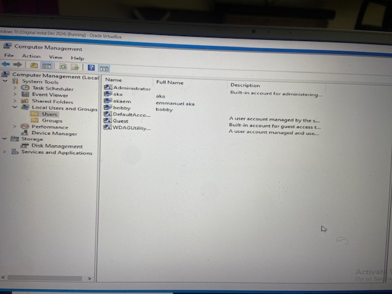
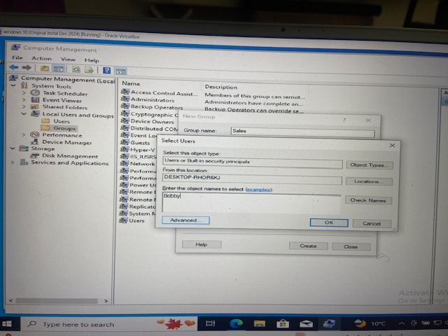
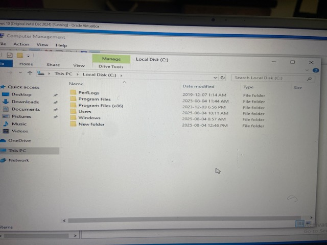
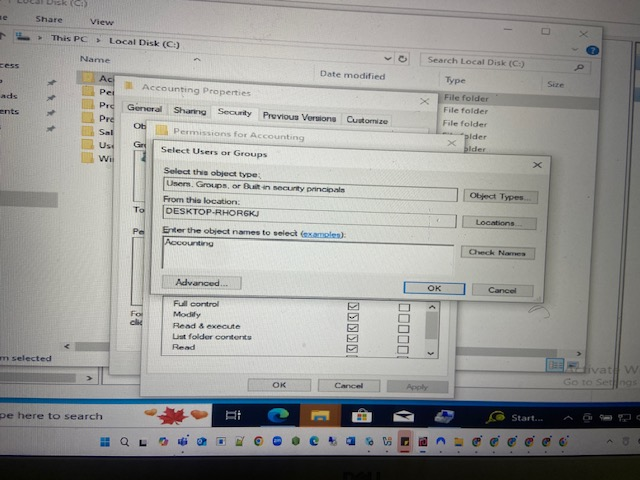
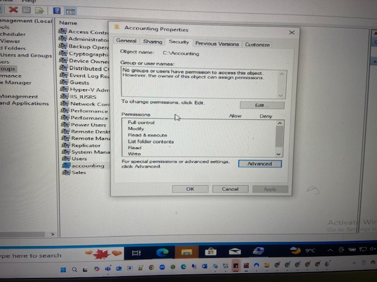
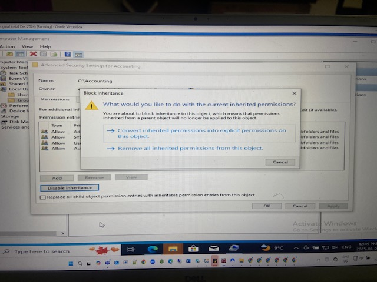
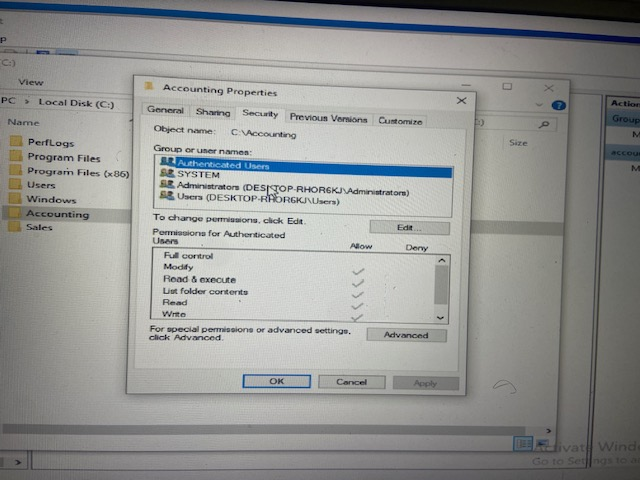

# Windows-RBAC-Permissions
Implementing Role-Based Access Control (RBAC) in Windows by creating users and groups, assigning folder permissions, and managing access rights.

# 🖥️ Windows RBAC Implementation

## Objective
Demonstrate how to implement Role-Based Access Control (RBAC) in Windows by:
- Creating users and groups in Computer Management.
- Assigning folder permissions based on roles.
- Modifying and restricting access rights.

---

## Steps Taken

1. **Create Users in Computer Management**
   - Created users: `akaem`, `bobby`.
   - Assigned them descriptive names.

2. **Create Groups**
   - Created `Accounting` group and added `akaem`.
   - Created `Sales` group and added `bobby`.

3. **Create Folders**
   - Created folders `C:\Accounting` and `C:\Sales`.

4. **Assign Permissions**
   - **Accounting folder:** 
     - `Accounting` group → Modify (no Full Control).
   - **Sales folder:**  
     - `Sales` group → Modify.
     - `Accounting` group → Read & Execute only.

5. **Modify Permissions**
   - Disabled inheritance where necessary.
   - Explicitly assigned or removed rights to enforce role restrictions.

---

## Outcome
- Users in `Accounting` can modify files in the Accounting folder but cannot delete or take ownership.
- Users in `Sales` can modify files in the Sales folder.
- Cross-access is restricted to Read & Execute only, preventing changes.

---

## Screenshots
1. Creating users in Computer Management  
   
2. Creating groups and assigning users  
   
3. Creating folders for each department  
   
4. Assigning Accounting folder permissions  
   
5. Assigning Sales folder permissions  
   
6. Disabling inheritance  
   
7. Testing permissions as each user  
   
